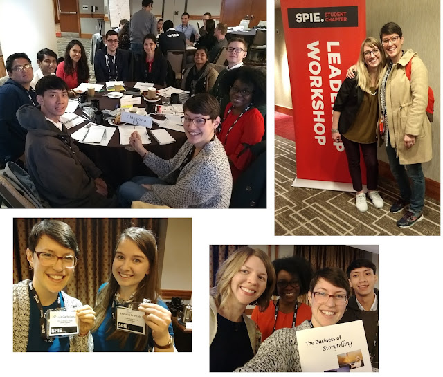
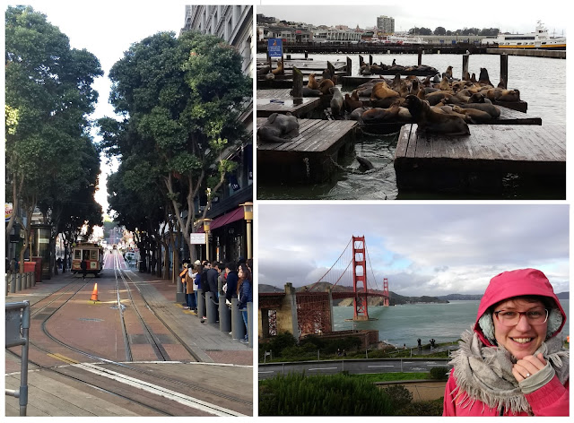

SPIE gives student chapters the opportunity to send every year one of the chapter’s officers to a SPIE conference + leader ship workshop, thanks to the Officer Travel Grant.
With the 2019 grant, our secretary Chiara Garbellotto got the chance to participate to Photonics West, one of the biggest optics and photonics conferences, which is organised every year in San Francisco.

Here are some comments and photos from Chiara:

‘’My time at Photonics West was simply amazing!

As an officer travel grant holder, I got to participate to the whole conference (huge!) and on the top of that I was also enrolled to the one-day leadership workshop held the Friday before the beginning of the conference. There, I got to meet many other student chapter officers from all over the worlds, we shared ideas, experiences and tips on how to run chapters, organise and promote activities, get people involved.  This day was also a great opportunity for us to network and get to know each other, which I found very nice both for the enjoyment of the conference itself ( we kept meeting and socialising throughout the rest of the conference) but also to create a network of contacts which I think will be very valuable for our chapter in the future.

I’m very happy and grateful that I got to use our SPIE Officer Travel Grant this year, and I can’t wait for somebody else to use next year’s one to got to the same (or another) conference, and have a similarly great experience to the one I had, meet many other people and enrich our chapter with new experiences and connections!

Here are some pictures from my time at Photonics West, and if you want to ask me more about the officer travel grant, about SPIE or our Glasgow University student chapter, feel free to contact me at any time at c.garbellotto.1@research.gla.ac.uk

Cheers,
Chiara.’’

**Top left:**  group activity at the leadership workshop
**Top right:** with Meagan All, the SPIE Student Chapter Lead
**Bottom left:** with Emma from the other student SPIE chapter based in Glasgow, at the University of Srathclyde (SCOPE)
**Bottom right:** with Christine Haas, having fun learning the secrets of story telling

From around San Francisco:

Out for dinner with SPIE friends from the leadership workshop

