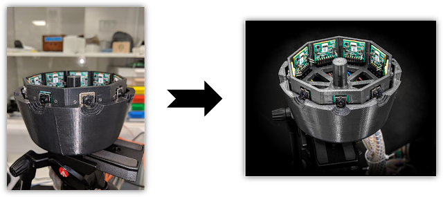

The UofGOS is very happy to advertise its first official event of 2019!

**What:**  Photography Workshop by Kevin Mitchell
**When:** Thursday 21st March 2019, 2:30pm - 5pm  (~2 hours workshop + a coffee break in the middle)
**Where:** Gilchrist seminar room (access from inside the Gilchrist Postgraduate Club), UoG main building, University Avenue

For whom: everybody's welcome, but will be particularly interesting for:
 - researchers looking for ways to make their setup look cooler on papers or social media
 - DSLR camera lovers
 - people who would like to know what a DSLR camera is

Kevin Mitchell  is a PhD student in the Optics Group and a keen enthusiast photographer. If you've ever been in the dungeon of the Kelvin Building you might have noticed some of his cool photographs on the walls, depicting various experiments and lab equipment. 
Last year he organised this workshop to pass on some of his tricks and tips, and we from the UofGOS have asked him to do it again!

In his workshop Kevin covers the basics, how to use the cameras, lenses and their settings, composition and lighting, introduces post processing, and gives some tips on how to get the best results.

Sign up through EventBrite and join us, it will be fun!

