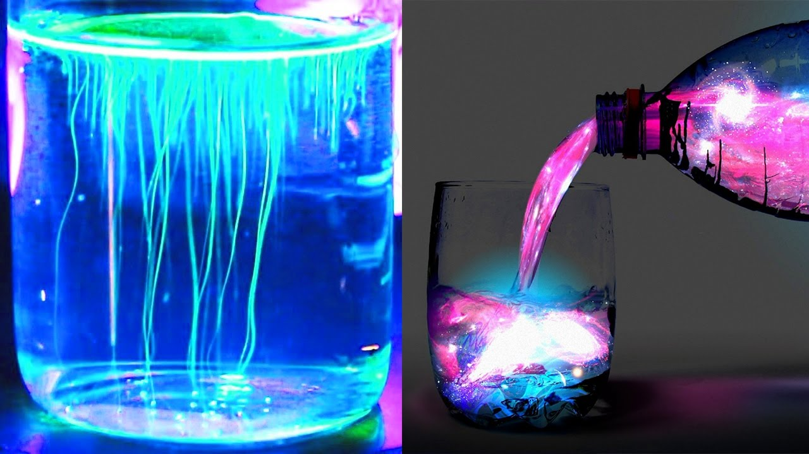

# UofGOS Photo Competition

## Follow the instructions below to enter and win a prize

We are running a photo competition on the theme of 'Science at Home'. Whether it's your workspace, a home experiment setup, or an educational activity, we want to see some of the science you have been doing outside of the lab.

Feel free to interpret the brief in any way you like, as long as the photo relates to the theme of 'Science at Home'.
​
### What are the prizes?

- Best photo: £50 voucher
- Runner up: £20 voucher

### How to enter the competition?

Send us your photo via twitter at @UofGOS and use #ScienceAtHomePosterCompetition in the tweet. If you do not have twitter, you can share the photo with us at uofgopticalsociety@gmail.com.

We will decide the winner for the competition and contact winners on 15th April 2021

