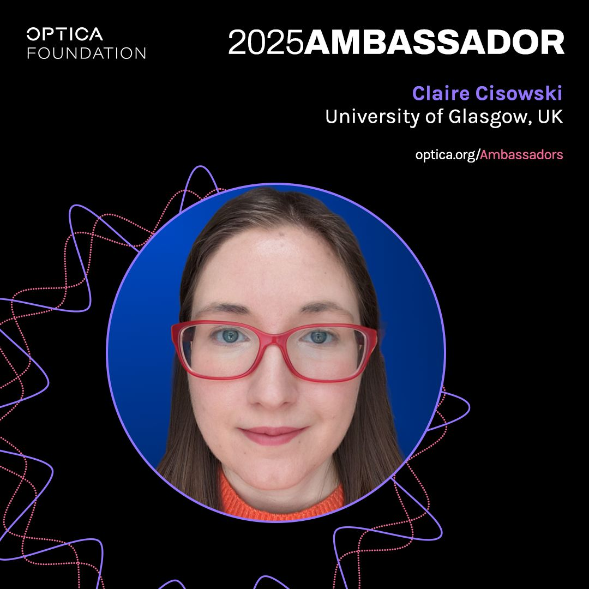

📢 Upcoming Online Talk – 4th December

Join us for an insightful session on “Set Yourself Up for Success in Academia” taking place on 4th December from 12:30 PM to 1:30 PM (Online).

This talk will be delivered by Dr Claire Cisowski, Research Fellow and Optica Ambassador:

Success in academia requires more than research output. This workshop will show students how to prepare strategically for the next phase of their career. Topics include identifying and developing key skills, networking, applying for funding, demonstrating independence, and actively engaging in meaningful career conversations with supervisors.

To register send us a DM on LinkedIn for the Zoom link!

