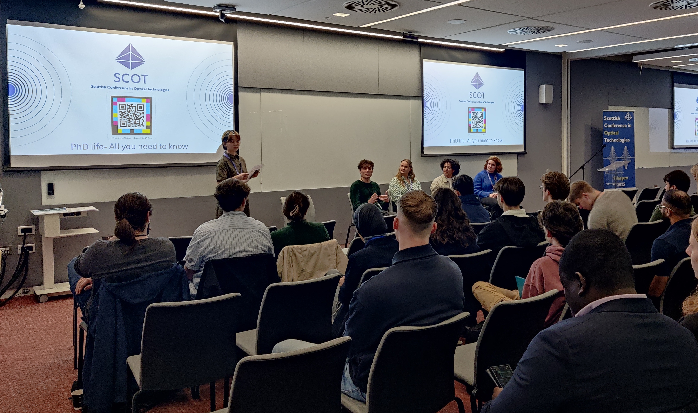
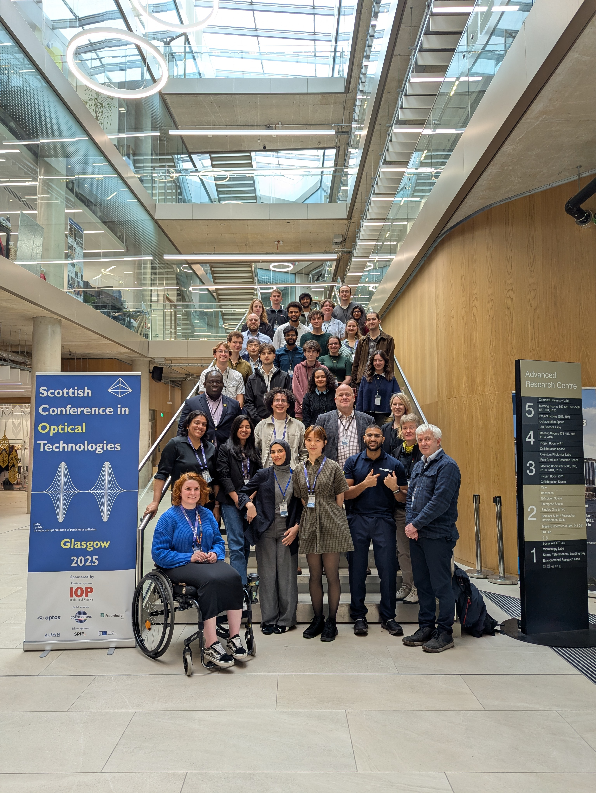

The 13th - 15th October the second edition of the Scottish Conference in Optical Technologies (SCOT) was held at the Advanced Research Centre, University of Glasgow. 

Organised by a committee of PhD students from the University of Glasgow, University of Strathclyde, Heriot-Watt University and the University of St Andrews; the conference brought together over 100 people from the Optics and Photonics sectors, from undergraduate researchers, early career researchers and industry professionals, for a 3-day conference, focused on bridging the gap between academia and industry. A huge thank you to our partners: Technology Scotland, and the Institute of Physics, and sponsors: Optos, Fraunhofer UK, Cornerstone, Alban Laser Systems, and UKRI Science and Technology Facilities Council.

Starting the conference with our career development day, we kicked off with Prof. Christopher Leburn, who discussed his interesting career journey through both academia and industry, and told us about the PQA. We had a few technical talks throughout the day, including a keynote from Prof. Anatoly Zayats. Dr Rachel Won ran a workshop on writing and submitting papers, and then joined us again for an interactive careers panel. We wrapped up the first day with a Poster session, a job fair and networking. 
The second day was our research focussed day, starting with our participant presentations, and then following up with a series of technical talks including keynotes from Dr Charlotte Eling, and Dr Lewis Hill. 

Our final day was an exciting addition to SCOT 25, following feedback from SCOT 24 we decided to invite undergraduate researchers for a day focused on building skills and connections for the future. Dr Alison McLeod from Technology Scotland introduced the day with an overview of the Photonics landscape in Scotland. The IoP gave an introduction to them and discussed the importance of development of skills, and how they can help. We ran a session on communicating research, hosted a panel based around working in diverse teams and how this breeds innovation. Dr Amin Din from the SCOT 24 committee returned as a speaker, discussing their new role at Optos, and also how SCOT 24 led to them being in that role. We then hosted a panel of PhD students, to discuss their PhD journey, the highs and the lows and everything in between. Our industry sponsors gave some short talks introducing their companies before we went into our closing posters and jobs fair, where the undergraduates could present their research posters. 

The impact of SCOT has been hugely unexpected from both the 2024 and the 2025 conference, and while the 2025 committee was smaller and we had a few more bumps in the road, we still organised a successful and have made an impact (including convincing some undergraduates to send off their applications for PhDs in photonics). 
Being a part of the founding SCOT committee, and chairing the committee for 2025, has been a hugely rewarding experience. I have learnt a vast quantity of skills and gained invaluable experience, and I am excited for SCOT 26.

